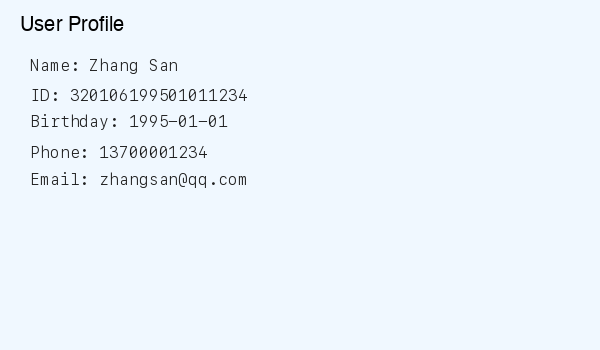
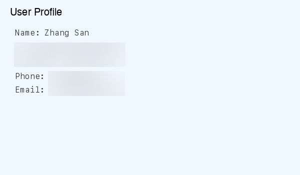
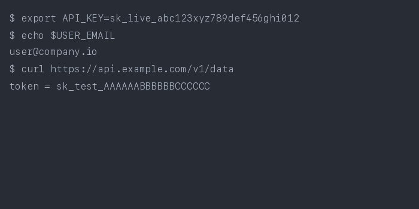
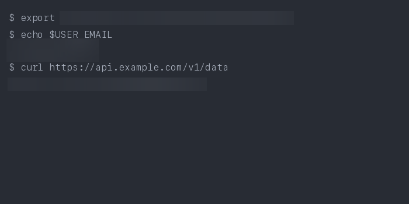
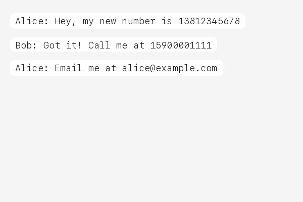
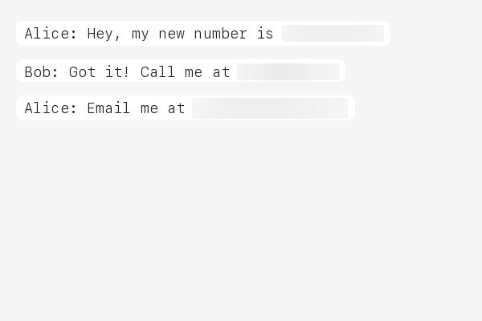

<p align="center">
  <h1 align="center">privacy-mask</h1>
  <p align="center">
    <strong>Detect and redact sensitive information in images — 100% local, 100% offline.</strong>
  </p>
  <p align="center">
    <a href="https://pypi.org/project/privacy-mask/"></a>
    <a href="https://pypi.org/project/privacy-mask/"></a>
    <a href="https://github.com/fullstackcrew-alpha/privacy-mask/blob/main/LICENSE"></a>
  </p>
</p>

> **Your images never leave your machine.** privacy-mask intercepts screenshots before they are sent to AI services, automatically detecting and masking phone numbers, ID cards, API keys, and 40+ other sensitive patterns.

---

## Before / After

| Original | Masked |
|----------|--------|
|  |  |
|  |  |
|  |  |

---

## Why?

When you share screenshots with AI assistants, you might accidentally expose:

- **Personal IDs** — national ID numbers, passports, social security numbers
- **Phone numbers & emails** — yours or your users'
- **API keys & tokens** — AWS, GitHub, Stripe, database credentials
- **Financial data** — bank card numbers, IBAN codes

Cloud-based redaction services require uploading your images — defeating the purpose. **privacy-mask processes everything locally before any data leaves your machine**, making it the only approach that truly protects your privacy.

This matters for compliance too: **GDPR**, **HIPAA**, and other regulations require that sensitive data be protected at the point of origin.

---

## Quick Start

```bash
# Install
pip install privacy-mask

# Mask a screenshot
privacy-mask mask screenshot.png

# One-time setup: auto-mask all images before AI upload
privacy-mask install
```

That's it. After `privacy-mask install`, every image you share with your AI coding assistant is automatically masked before upload.

---

## Agent Integration

privacy-mask follows the [agentskills.io](https://agentskills.io) SKILL.md standard and works with **20+ AI coding tools** that run locally:

| Platform | How it works |
|----------|-------------|
| **Claude Code** | Hook auto-masks images before upload |
| **Cursor** | SKILL.md auto-detected in project |
| **VS Code Copilot** | SKILL.md auto-detected in project |
| **Gemini CLI** | SKILL.md auto-detected in project |
| **OpenHands** | CLI available via shell |
| **Goose** | SKILL.md auto-detected |
| **Roo Code** | SKILL.md auto-detected |
| **aider** | CLI available via shell |
| **Cline** | SKILL.md auto-detected |
| **Windsurf** | SKILL.md auto-detected |
| **OpenClaw** | SKILL.md auto-detected |

> **Note:** privacy-mask only works with **local agents**. Web-based AI (ChatGPT Web, Gemini Web) uploads images to cloud servers before processing — local masking cannot help there. This tool is designed for agents that run on your machine.

---

## What It Detects

**47 regex rules** covering **15+ countries**:

| Category | Rules |
|----------|-------|
| **IDs** | Chinese ID card & passport, HK/TW ID, US SSN, UK NINO, Canadian SIN, Indian Aadhaar & PAN, Korean RRN, Singapore NRIC, Malaysian IC |
| **Phone** | Chinese mobile & landline, US phone, international (+prefix) |
| **Financial** | Bank card (UnionPay/Visa/MC), Amex, IBAN, SWIFT/BIC |
| **Developer Keys** | AWS access key, GitHub token, Slack token, Google API key, Stripe key, JWT, database connection strings, generic API keys, SSH/PEM private keys |
| **Crypto** | Bitcoin address (legacy + bech32), Ethereum address |
| **Other** | Email, birthday, IPv4/IPv6, MAC address, UUID, Chinese license plate, passport MRZ, URL auth tokens, WeChat/QQ IDs |

---

## How It Works

```
┌──────────┐     ┌───────────┐     ┌──────────┐     ┌──────────────┐
│  Image   │────▶│    OCR    │────▶│  Detect  │────▶│     Mask     │
│  Input   │     │ Tesseract │     │ 47 Regex │     │ Blur / Fill  │
│          │     │ + Rapid   │     │  Rules   │     │              │
└──────────┘     └───────────┘     └──────────┘     └──────────────┘
                  Extract text      Match patterns    Redact regions
                  + bounding boxes  with positions    in original image
```

1. **OCR** — Dual-engine: Tesseract + RapidOCR extract text with bounding boxes. Multi-strategy preprocessing (grayscale, binarization, contrast enhancement) with confidence-based merge for maximum accuracy.

2. **Detect** — 47 compiled regex rules scan OCR results. Overlapping detections on nearby bounding boxes are merged automatically.

3. **Mask** — Matched regions are blurred (default) or filled with solid color. Output is saved as a new file or overwrites the original.

---

## CLI Usage

```bash
# Basic: mask → screenshot_masked.png
privacy-mask mask screenshot.png

# Overwrite original
privacy-mask mask screenshot.png --in-place

# Detection only, no masking
privacy-mask mask screenshot.png --dry-run

# Black fill instead of blur
privacy-mask mask screenshot.png --method fill

# Custom config
privacy-mask mask screenshot.png --config my_rules.json

# Output path
privacy-mask mask screenshot.png -o /tmp/safe.png
```

Output is JSON:
```json
{
  "status": "success",
  "input": "screenshot.png",
  "output": "screenshot_masked.png",
  "detections": [
    {"label": "PHONE_CN", "text": "***", "bbox": [10, 20, 100, 30]},
    {"label": "EMAIL", "text": "***", "bbox": [10, 50, 200, 30]}
  ],
  "summary": "Masked 2 regions: 1 PHONE_CN, 1 EMAIL"
}
```

---

## Configuration

Rules are defined in `config.json`. You can pass a custom config:

```bash
privacy-mask mask image.png --config my_config.json
```

Each rule has a `name`, `pattern` (regex), and optional `flags`. Example:

```json
{
  "rules": [
    {
      "name": "MY_CUSTOM_ID",
      "pattern": "CUSTOM-\\d{8}",
      "flags": ["IGNORECASE"]
    }
  ]
}
```

See the [bundled config.json](mask_engine/data/config.json) for all 47 rules.

---

## Requirements

- **Python 3.10+**
- **Tesseract OCR**
  - macOS: `brew install tesseract`
  - Ubuntu: `sudo apt install tesseract-ocr`
  - Windows: [Download installer](https://github.com/UB-Mannheim/tesseract/wiki)

---

## Contributing

Contributions are welcome! Here's how you can help:

- **Add detection rules** — submit new regex patterns for your country's ID format
- **Improve OCR accuracy** — better preprocessing strategies
- **Report false positives** — help us tune regex patterns
- **Add tests** — currently 174 tests, always room for more

```bash
# Run tests
pip install -e .
python -m pytest tests/ -v
```

---

## License

MIT

---

<details>
<summary><strong>🇨🇳 中文说明</strong></summary>

## privacy-mask — 本地图片隐私打码工具

在截图发送给 AI 助手之前，自动检测并遮盖敏感信息。**100% 本地处理，数据不出本机。**

### 特性

- **47 条正则规则**，覆盖 15+ 国家的证件、电话、银行卡、开发者密钥等
- **双 OCR 引擎**（Tesseract + RapidOCR），多策略预处理，置信度融合
- **一键安装**：`pip install privacy-mask && privacy-mask install`
- **兼容 20+ AI 编程工具**：Claude Code、Cursor、VS Code Copilot、Gemini CLI 等
- 支持模糊和填充两种打码方式
- 自定义规则配置

### 快速开始

```bash
pip install privacy-mask
privacy-mask mask screenshot.png          # 打码
privacy-mask mask screenshot.png --dry-run # 仅检测
privacy-mask install                       # 安装全局钩子，自动打码
```

### 为什么选择本地打码？

云端脱敏工具需要上传你的图片——这本身就违背了隐私保护的初衷。privacy-mask 在图片离开你的电脑之前就完成打码，是真正保护隐私的唯一方案。

</details>
